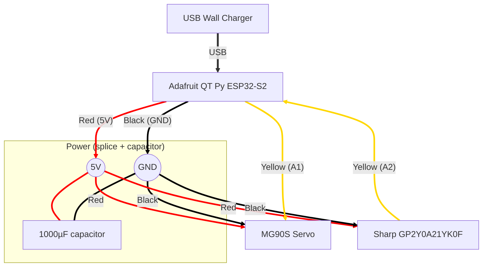

# Chonk-O-Matic

An ESPHome-based control system for an automatic cat feeder. Unlike standard "smart" feeders that become dumb bricks when the WiFi dies, this system is designed with an **offline-first** philosophy built around a **Credit System** that separates the acts of *awarding food entitlements* and *physically dispensing food*.

**Features**

- JSON-configurable feeding schedule directly from Home Assistant
- Credit-based system — award credits on a schedule, let the cat claim them on demand via proximity sensor
- Graceful offline handling — all state persists through power loss and WiFi drops
- Clock catchup logic — missed scheduled feeds are processed when connectivity is restored
- Anti-jam servo sequence
- Configurable daily limits, cooldown timers, and servo calibration — all via substitutions, no reflashing needed
- Three Home Assistant API services for external automation integration

---

## Hardware

| Component | Part |
| :--- | :--- |
| **MCU** | Adafruit QT Py ESP32-S2 |
| **Proximity sensor** | Sharp GP2Y0A21YK0F (analog IR distance) |
| **Actuator** | MG90S micro servo (standard 180°) |
| **Power** | USB-C 5 V — servo and sensor must use the 5 V rail, **not** 3.3 V |

### Pinout

| Component | QT Py Pin | Internal GPIO | Notes |
| :--- | :--- | :--- | :--- |
| Sensor signal | `A2` | GPIO9 | ADC1 channel — must use ADC1 (A2 or A3); ADC2 conflicts with WiFi |
| Servo PWM | `A1` | GPIO17 | Standard PWM output |
| Power | `5V` + `GND` | — | Direct USB pass-through |

### Wiring Diagram



The 1000 µF capacitor on the 5 V rail absorbs current spikes when the servo starts, preventing brownouts on the ESP32.

---

## Installation

### Prerequisites

- A working [Home Assistant](https://www.home-assistant.io/) installation
- The [ESPHome add-on](https://esphome.io/guides/getting_started_hassio) installed (version **2023.2.0** or later for GitHub package support)

### Step 1 — Copy the example device config

Copy [`example.yaml`](example.yaml) into your ESPHome configuration directory (on Home Assistant this is `/config/esphome/`). Rename it to something meaningful for your device, e.g. `cat-feeder.yaml`.

This file is your device-specific config. Notice the `packages:` block inside it:

```yaml
packages:
  feeder_logic:
    url: https://github.com/barjonas/chonk-o-matic
    ref: main
    files:
      - chonk-o-matic.yaml
```

When ESPHome compiles your device, it automatically fetches `chonk-o-matic.yaml` (and the accompanying `json_helper.h`) directly from this GitHub repository and merges it with your device config. You do not need to download or copy any package files manually — ESPHome handles it. Your device YAML only needs to contain the things that are unique to your hardware: board type, pins, WiFi credentials, and tuning substitutions.

### Step 2 — Create secrets

Add the following entries to your ESPHome `secrets.yaml`:

```yaml
# secrets.yaml
wifi_ssid: "Your WiFi SSID"
wifi_password: "Your WiFi password"
fallback_ap_password: "some-fallback-password"
dns_domain: "local"          # or your local domain, e.g. home.arpa
esphome_api_key: "paste-a-generated-key-here"
```

Generate an API key at <https://esphome.io/components/api.html> (use the **Generate Encryption Key** button).

### Step 3 — Adjust substitutions

Open your device YAML and edit the `substitutions:` block at the top:

```yaml
substitutions:
  devicename: "cat-feeder"          # ESPHome device ID (no spaces)
  devicename_friendly: "Cat Feeder" # Friendly name shown in Home Assistant

  # Hardware pins — defaults match the Adafruit QT Py ESP32-S2
  servo_pin: A1
  sensor_pin: A2

  # Tune these for your feeder mechanics (no reflashing needed after first flash)
  sensor_threshold_meters: "0.15"
  servo_dispense_level: "50%"
  # ... see example.yaml for the full list
```

### Step 4 — Flash

In the ESPHome dashboard, click **Install** on your device. The first flash requires a USB cable; all subsequent updates can be done over-the-air.

### Step 5 — Configure the schedule

Once the device is online, find it in Home Assistant under **Settings → Devices**. Open the device page and set the **Feeding Schedule (JSON)** configuration field. See [Schedule Format](#schedule-format) below for examples.

---

## How It Works

### The Credit System

| Term | Definition |
| :--- | :--- |
| **Unit** | One portion of food — one servo cycle. All counters track units. |
| **Credit** | A virtual token. One credit entitles one unit to be dispensed. Balance cannot go below zero. |
| **Award** | Adding credits. A schedule entry's `award` field adds credits (can be negative to revoke). |
| **Dispense** | The physical act of releasing one unit via the servo. Each automatic dispense consumes one credit. |
| **Claim** | A presence-triggered dispense. Cat detected → one credit consumed → one unit dispensed. Requires credits > 0 and daily limit not reached. |
| **Presence** | Cat detected by proximity sensor (distance below the configured threshold). |

### Schedule Processing

The schedule runs once per minute. Each entry in the JSON array can independently award credits, dispense immediately, or both:

1. `award` is applied to the credit balance (clamped to `[0, max_credits]`)
2. `dispense` units are physically dispensed (limited by available credits and daily max)

### Offline & Time-Jump Handling

The device has no hardware RTC — it syncs time from Home Assistant via the API.

**On WiFi reconnect or NTP correction**, the system detects a time jump (gap > 2 minutes) and runs a catchup loop over all schedule entries that were missed, in document order. The system errs on the side of over-feeding rather than under-feeding.

**On reboot without WiFi**, all persistent state (credits, daily count, lifetime count, schedule) is restored from flash. Once time syncs, catchup fires for any missed entries.

**Backward time jumps** (e.g. NTP correction going backward) are ignored — no duplicate feeding.

### Servo Anti-Jam Sequence

Each dispense performs: rollback → open → rollback → idle. This prevents mechanical binding and clears minor obstructions.

---

## Schedule Format

The **Feeding Schedule (JSON)** field accepts a JSON array. Each entry:

| Property | Type | Default | Description |
| :--- | :--- | :--- | :--- |
| `time` | string | required | `"H:MM"` or `"HH:MM"` — both `"6:55"` and `"06:55"` are valid |
| `award` | integer | `0` | Credits to add. Negative values remove credits. |
| `dispense` | integer | `0` | Units to dispense immediately. Limited by available credits. |

### Examples

**Simple 3-meal-a-day (unconditional):**
```json
[
  {"time": "7:00",  "award": 1, "dispense": 1},
  {"time": "12:00", "award": 1, "dispense": 1},
  {"time": "18:00", "award": 1, "dispense": 1}
]
```

**Demand-based feeding (cat must be present to claim):**
```json
[
  {"time": "6:00", "award": 3}
]
```
Awards 3 credits at 6 AM. Nothing dispenses at schedule time — the cat must approach the sensor to claim each credit throughout the day.

**Hybrid: unconditional breakfast + on-demand lunch + nightly expiry:**
```json
[
  {"time": "7:00",  "award": 1, "dispense": 1},
  {"time": "12:00", "award": 2},
  {"time": "22:00", "award": -999}
]
```
Breakfast is unconditional. Two on-demand credits at noon. Any unclaimed credits are wiped at 10 PM to prevent overnight gorging.

**Conditional top-up (dispense only if credits remain):**
```json
[
  {"time": "7:00",  "award": 2},
  {"time": "12:00", "dispense": 1},
  {"time": "18:00", "dispense": 1}
]
```
Awards 2 credits in the morning. Scheduled dispenses at noon and 6 PM only fire if the cat hasn't already claimed both credits via presence.

---

## Configuration Reference

All parameters are set as `substitutions` in your device YAML.

### Sensor

| Substitution | Default | Description |
| :--- | :--- | :--- |
| `sensor_pin` | `A2` | ADC pin. Must be ADC1 (A2 or A3 on QT Py). |
| `sensor_threshold_meters` | `"0.15"` | Distance (metres) below which the cat is considered present. |

### Servo

| Substitution | Default | Description |
| :--- | :--- | :--- |
| `servo_pin` | `A1` | PWM output pin. |
| `servo_min_level` | `"3%"` | Pulse width for 0° (closed). |
| `servo_max_level` | `"12%"` | Pulse width for 180° (fully open). |
| `servo_idle_level` | `"3%"` | Rest/closed position. |
| `servo_dispense_level` | `"50%"` | Dispense angle (50% ≈ 90°). |
| `servo_rollback_level` | `"1%"` | Anti-jam pull-back position. |
| `servo_rollback_interval` | `"300ms"` | Hold time at rollback position. |
| `door_open_duration` | `"1s"` | How long the servo stays open per unit. |

### Timing & Limits

| Substitution | Default | Description |
| :--- | :--- | :--- |
| `daily_counter_reset_time` | `"06:00"` | When the daily dispense counter resets. |
| `min_dispense_delay_scheduled` | `"1000"` | Minimum ms between sequential scheduled dispenses. |
| `min_dispense_delay_presence` | `"30000"` | Minimum ms between presence-triggered dispenses. |

### Servo Calibration

1. Flash the firmware once (USB required for first flash).
2. Use **Force Dispense** in Home Assistant to test the motion.
3. Edit substitutions in your device YAML and redeploy OTA — no USB needed.
4. Repeat until the motion is correct.

Common adjustments:
- Servo doesn't fully close → decrease `servo_idle_level` (e.g. `"2%"`)
- Servo doesn't open enough → increase `servo_dispense_level` (e.g. `"55%"`)
- Wrong total range → adjust `servo_min_level` / `servo_max_level`

---

## Home Assistant Entities

### Primary controls (visible by default)

| Entity | Type | Description |
| :--- | :--- | :--- |
| Award Credit | Button | Awards 1 credit |
| Dispense Credit | Button | Dispenses 1 unit if credits available |
| Force Dispense | Button | Awards and immediately dispenses 1 unit |
| Credits Remaining | Sensor | Current credit balance |
| Units Dispensed Today | Sensor | Daily dispense counter |

### Configuration (in device details)

| Entity | Type | Description |
| :--- | :--- | :--- |
| Feeding Schedule (JSON) | Text | JSON schedule array |
| Max Daily Dispenses | Number | Hard cap on daily dispenses (1–999) |
| Max Credits | Number | Upper bound on credit balance (1–999) |

### Diagnostic (in device details)

| Entity | Type | Description |
| :--- | :--- | :--- |
| Proximity Distance | Sensor | Converted distance in metres |
| Lifetime Units Dispensed | Sensor | Total dispenses since first boot |

### API Services

Callable from Home Assistant automations:

| Service | Effect |
| :--- | :--- |
| `award_credit` | Awards 1 credit |
| `dispense_credit` | Dispenses 1 unit (if credits available) |
| `force_dispense` | Awards 1 credit and immediately dispenses it |

---

## Persistent State

The following values survive power loss (stored in ESP32 NVS flash):

| Variable | Description |
| :--- | :--- |
| `credits` | Credit balance |
| `units_dispensed_today` | Daily counter |
| `lifetime_dispensed` | All-time total |
| `feed_schedule_json` | The schedule (no need to resend after a power cut) |
| `last_reset_day` | Tracks when the daily counter was last reset |
| `last_known_hour` / `last_known_minute` | Used for time-jump detection |

---

## Repository Structure

```text
chonk-o-matic/
├── chonk-o-matic.yaml   # The reusable ESPHome package (pulled via GitHub packages)
├── json_helper.h        # C++ header bundled with the package
├── example.yaml         # Copy this to your ESPHome config directory and customise
└── README.md
```

---

## License

MIT
